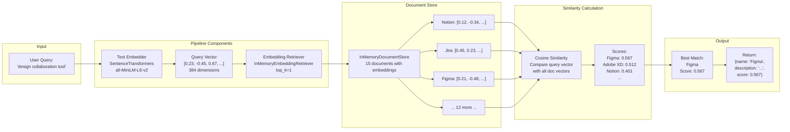

```mermaid
    graph LR
    subgraph Input
        Query["User Query:<br/>'design collaboration tool'"]
    end
    
    subgraph "Pipeline Components"
        TextEmbed["Text Embedder<br/>SentenceTransformers<br/>all-MiniLM-L6-v2"]
        QueryVector["Query Vector<br/>[0.23, -0.45, 0.67, ...]<br/>384 dimensions"]
        Retriever["Embedding Retriever<br/>InMemoryEmbeddingRetriever<br/>top_k=1"]
    end
    
    subgraph "Document Store"
        DocStore["InMemoryDocumentStore<br/>15 documents with embeddings"]
        Doc1["Notion: [0.12, -0.34, ...]"]
        Doc2["Jira: [0.45, 0.23, ...]"]
        Doc3["Figma: [0.21, -0.48, ...]"]
        DocN["... 12 more ..."]
    end
    
    subgraph "Similarity Calculation"
        Cosine["Cosine Similarity<br/>Compare query vector<br/>with all doc vectors"]
        Scores["Scores:<br/>Figma: 0.567<br/>Adobe XD: 0.512<br/>Notion: 0.401<br/>..."]
    end
    
    subgraph Output
        Best["Best Match:<br/>Figma<br/>Score: 0.567"]
        Result["Return:<br/>{name: 'Figma',<br/>description: '...',<br/>score: 0.567}"]
    end
    
    Query --> TextEmbed
    TextEmbed --> QueryVector
    QueryVector --> Retriever
    
    Retriever --> DocStore
    DocStore --> Doc1
    DocStore --> Doc2
    DocStore --> Doc3
    DocStore --> DocN
    
    Doc1 --> Cosine
    Doc2 --> Cosine
    Doc3 --> Cosine
    DocN --> Cosine
    
    Cosine --> Scores
    Scores --> Best
    Best --> Result

```