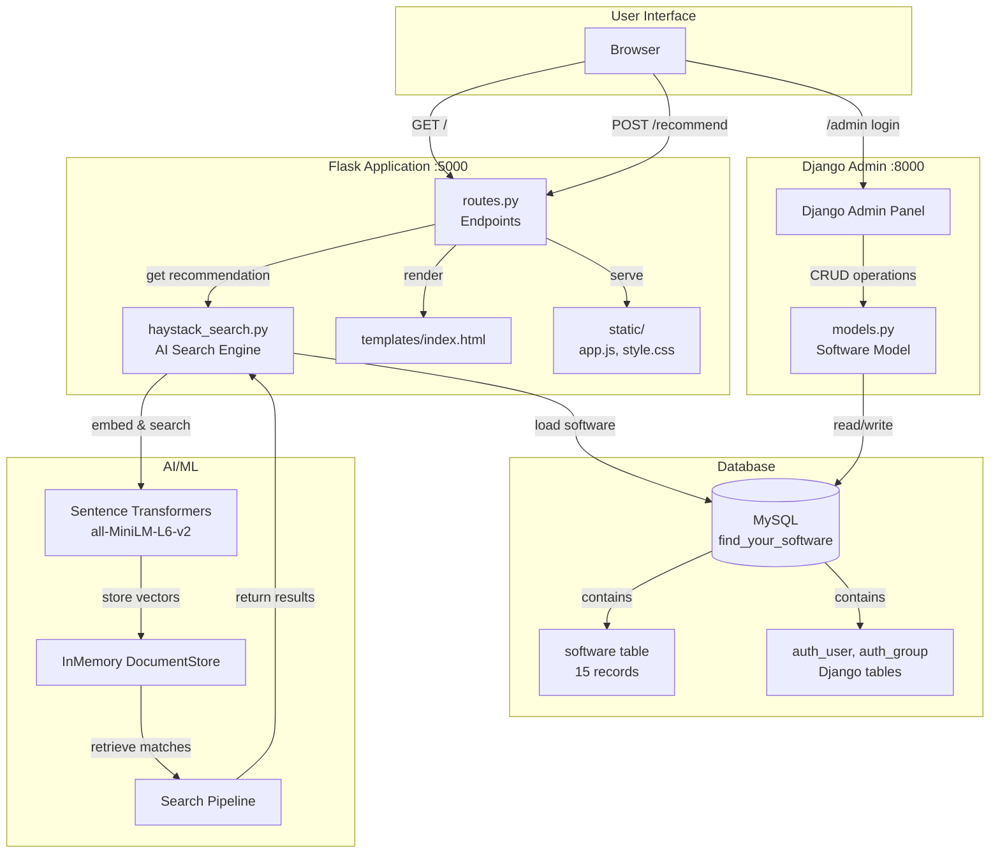

```mermaid
graph TB
    subgraph "User Interface"
        Browser[Browser]
    end
    
    subgraph "Flask Application :5000"
        Routes[routes.py<br/>Endpoints]
        Haystack[haystack_search.py<br/>AI Search Engine]
        Templates[templates/index.html]
        Static[static/<br/>app.js, style.css]
    end
    
    subgraph "Django Admin :8000"
        DjangoAdmin[Django Admin Panel]
        DjangoModels[models.py<br/>Software Model]
    end
    
    subgraph "Database"
        MySQL[(MySQL<br/>find_your_software)]
        SoftwareTable[software table<br/>15 records]
        AuthTables[auth_user, auth_group<br/>Django tables]
    end
    
    subgraph "AI/ML"
        SentenceTransformers[Sentence Transformers<br/>all-MiniLM-L6-v2]
        DocumentStore[InMemory DocumentStore]
        Pipeline[Search Pipeline]
    end
    
    Browser -->|GET /| Routes
    Browser -->|POST /recommend| Routes
    Routes -->|render| Templates
    Routes -->|serve| Static
    Routes -->|get recommendation| Haystack
    
    Haystack -->|load software| MySQL
    Haystack -->|embed & search| SentenceTransformers
    SentenceTransformers -->|store vectors| DocumentStore
    DocumentStore -->|retrieve matches| Pipeline
    Pipeline -->|return results| Haystack
    
    Browser -->|/admin login| DjangoAdmin
    DjangoAdmin -->|CRUD operations| DjangoModels
    DjangoModels -->|read/write| MySQL
    
    MySQL -->|contains| SoftwareTable
    MySQL -->|contains| AuthTables

```