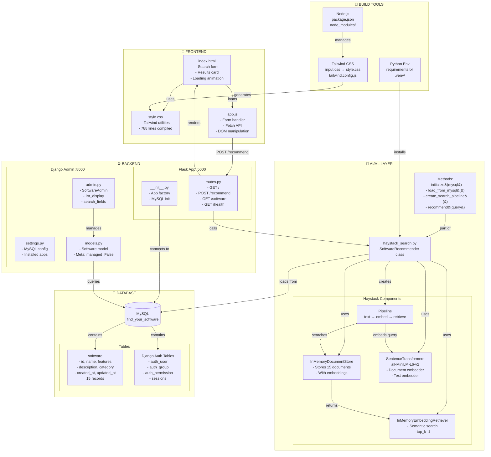

```mermaid
    graph TB
        subgraph Frontend["🎨 FRONTEND"]
            HTML[index.html<br/>- Search form<br/>- Results card<br/>- Loading animation]
            CSS[style.css<br/>- Tailwind utilities<br/>- 788 lines compiled]
            JS[app.js<br/>- Form handler<br/>- Fetch API<br/>- DOM manipulation]
        end
        
        subgraph Backend["⚙️ BACKEND"]
            subgraph Flask["Flask App :5000"]
                FlaskInit[__init__.py<br/>- App factory<br/>- MySQL init]
                FlaskRoutes[routes.py<br/>- GET /<br/>- POST /recommend<br/>- GET /software<br/>- GET /health]
            end
            
            subgraph Django["Django Admin :8000"]
                DjangoSettings[settings.py<br/>- MySQL config<br/>- Installed apps]
                DjangoAdmin[admin.py<br/>- SoftwareAdmin<br/>- list_display<br/>- search_fields]
                DjangoModels[models.py<br/>- Software model<br/>- Meta: managed=False]
            end
        end
        
        subgraph AI["🤖 AI/ML LAYER"]
            HaystackService[haystack_search.py<br/>SoftwareRecommender class]
            
            subgraph Components["Haystack Components"]
                DocStore[InMemoryDocumentStore<br/>- Stores 15 documents<br/>- With embeddings]
                Embedder[SentenceTransformers<br/>all-MiniLM-L6-v2<br/>- Document embedder<br/>- Text embedder]
                Retriever[InMemoryEmbeddingRetriever<br/>- Semantic search<br/>- top_k=1]
                SearchPipeline[Pipeline<br/>text → embed → retrieve]
            end
            
            Methods[Methods:<br/>- initialize&#40;mysql&#41;<br/>- load_from_mysql&#40;&#41;<br/>- create_search_pipeline&#40;&#41;<br/>- recommend&#40;query&#41;]
        end
        
        subgraph Database["💾 DATABASE"]
            MySQL[(MySQL<br/>find_your_software)]
            
            subgraph Tables["Tables"]
                SoftwareT[software<br/>- id, name, features<br/>- description, category<br/>- created_at, updated_at<br/>15 records]
                AuthT[Django Auth Tables<br/>- auth_user<br/>- auth_group<br/>- auth_permission<br/>- sessions]
            end
        end
        
        subgraph Build["🔧 BUILD TOOLS"]
            Tailwind[Tailwind CSS<br/>input.css → style.css<br/>tailwind.config.js]
            NPM[Node.js<br/>package.json<br/>node_modules/]
            Python[Python Env<br/>requirements.txt<br/>.venv/]
        end
        
        %% Frontend connections
        HTML -->|uses| CSS
        HTML -->|loads| JS
        JS -->|POST /recommend| FlaskRoutes
        
        %% Backend connections
        FlaskRoutes -->|calls| HaystackService
        FlaskRoutes -->|renders| HTML
        FlaskInit -->|connects to| MySQL
        
        DjangoAdmin -->|manages| DjangoModels
        DjangoModels -->|queries| MySQL
        
        %% AI connections
        HaystackService -->|uses| DocStore
        HaystackService -->|uses| Embedder
        HaystackService -->|uses| Retriever
        HaystackService -->|creates| SearchPipeline
        HaystackService -->|loads from| MySQL
        
        SearchPipeline -->|embeds query| Embedder
        SearchPipeline -->|searches| DocStore
        DocStore -->|returns| Retriever
        
        Methods -->|part of| HaystackService
        
        %% Database connections
        MySQL -->|contains| SoftwareT
        MySQL -->|contains| AuthT
        
        %% Build tools
        Tailwind -->|generates| CSS
        NPM -->|manages| Tailwind
        Python -->|installs| HaystackService
        
        
```